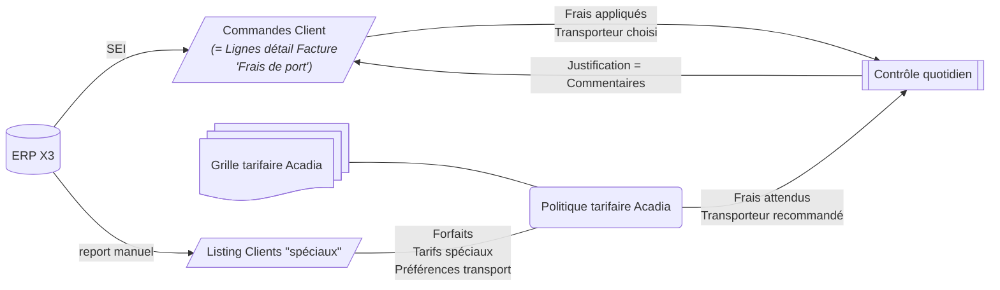
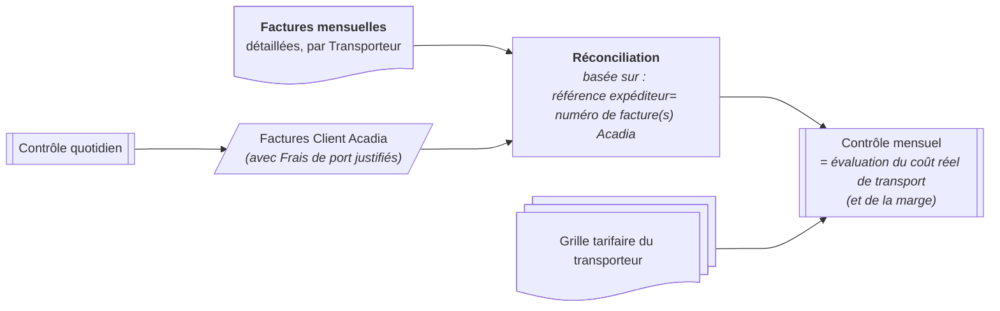
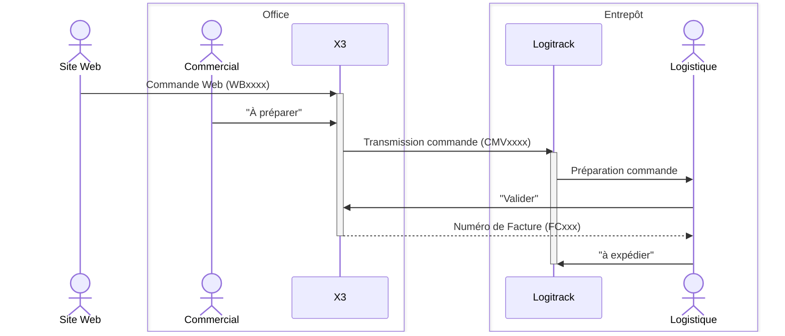

# ComptaTransport
Ce dépôt de code héberge l'ensemble des développements logiciel du projet "ComptaTransport" d'Acadia.

Le livrable cible du projet :
- consiste en une application intranet et ses différents processus d'intégration au SI Acadia existant
- permet de gérer le transport du point de vue Comptable et Contrôle de gestion : contrôle de la bonne application de la grille Acadia dans les commandes, agrégation et contrôle des factures transporteurs,  référentiel complémentaire par rapport à l'ERP (Sage X3), etc.

## Analyse
Le découpage initial du projet fait apparaître 3 thématiques, chacune s'appuyant sur les précédentes :
- A. Grilles tarifaires
- B. Contrôle quotidien
- C. Contrôle mensuel
  
Pour information, leurs descriptions et les principaux résultats d'analyse sont disponibles dans les items correspondant dans [le suivi de projet Github](https://github.com/orgs/Acadia-Informatique/projects/1). Ce dernier permet également de connaître l'état d'avancement et les tâches en cours, mais aussi les travaux futurs déjà identifiés.

## Compléments graphiques
Note : Un bug empêche actuellement de voir les graphiques avec les flèches dans le items de suivi de projet. Vous trouverez ci-après un complément aux analyses
[B.0)](https://github.com/orgs/Acadia-Informatique/projects/1?pane=issue&itemId=128330473)
et [C.0)](https://github.com/orgs/Acadia-Informatique/projects/1/views/1?pane=issue&itemId=128331328)

### Contrôle quotidien

### Contrôle mensuel

### Initialisation des n° de référence chez Acadia

## Prototypes
Parfois les analyses seront complétées par des démos interactives, qui permettent de démontrer la bonne compréhension de certains concepts fonctionnels. Mais des versions plus abouties peuvent également servir de prototypes de l'application réelle.

Nous tâcherons de les rendre disponibles ici :
- [Modèle général de Grille tarifaire](https://acadia-informatique.github.io/ComptaTransport/prototypes/PriceGridJs/grid.html)
	Un lien de téléchargement d'une grille exemple est fournie dans le panneau droit du prototype (section Export/Import). Mais nous vous proposerons ici des grilles plus complètes (mais un peu expérimentales) au fur et à fur, toujours à titre d'exemple :
	- export [Grille frais de port ACADIA 2025](https://acadia-informatique.github.io/ComptaTransport/prototypes/PriceGridJs/tarifs_ACADIA-alt.grille)
 	- export [Grille tarifaire Geodis 2023](https://acadia-informatique.github.io/ComptaTransport/prototypes/PriceGridJs/tarifs_Geodis_2023.grille)

